# Deadline Setup On Ubuntu

Deadline works with 5 different component

* ```Deadline Clients```
    
    The appliations that users install on their end to interact with deadline. (Deadline Monitor, Deadliine Worker...)

* ```MongoDB```

    The data base Deadline uses to store job status, priority, dependencies, work infomations, pools, groups, limits, user settings, and statistics


* ```Deadline Repository```

    A repository(folder) Deadline uses to store plugins, scripts, render logs, configure files. it should not be used for maya projects.

* ```Deadline Remote Conection Server```

    A server running on the server machine that:
    - Talks to the deadline repository and MongoDB
    - All deadline clients connects to it to access the deadline repository and MongoDB, it acts like the middle man between clients and MongoDB and Dedline Repository.

* ```SMB or NFS shared network location```

    A share network location that all render workers can access, this is the place a maya project is placed, before rendering.


# Setup Steps:

- The order of installation/setup is:

    1, MongoDB

    2, Deadline Repository
     
    3, Deadline Remote Connection Server

    4, SMB file server 

    5, Deadline Client on user machines

## Step 1 - MongoDB

[Reference Steps](https://www.cherryservers.com/blog/install-mongodb-ubuntu-2404)

upgrade the system:
```
sudo apt update
```

```
sudo apt upgrade
```
install curl (a downloading tool):

```
sudo apt install -y gnupg curl
```

Use the cURL utility to import the MongoDB pbulic GPG key:

```
curl -fsSL https://www.mongodb.org/static/pgp/server-8.0.asc | sudo gpg -o /usr/share/keyrings/mongodb-server-8.0.gpg --dearmor
```

Add the MongoDB repository to the list of sources on your system:
```
echo "deb [ arch=amd64,arm64 signed-by=/usr/share/keyrings/mongodb-server-8.0.gpg ] https://repo.mongodb.org/apt/ubuntu noble/mongodb-org/8.0 multiverse" | sudo tee /etc/apt/sources.list.d/mongodb-org-8.0.list
```
Update system again:
```
sudo apt update
```

Install MongoDB
```
sudo apt install -y mongodb-org
```

Start and enable MongoDB

```
sudo systemctl start mongod
sudo systemctl enable mongod
```

Check MogoDB status
```
sudo systemctl status mongod
```
If the status log shows failed or exited:
* be sure to double check the version being installed is compatiable with the operating system and cpu. easiest way to do that is search for ```install MongoDB on Ubuntu 24.04``` (search for how to install on your specific OS and version)

* be sure MongoDB has permissions on

    /var/log/mongodb

    /var/lib/mongodb

Try mongo shell
```
mongosh
```
### MongoDB configs:
use this command to open the config file:
```
sudo vim /etc/mongod.conf
```

Change the MongoDB data base path by setting dbPath:
```
# Where and how to store data.
storage:
    dbPath: /your/prefered/database/path
```


Allow MongoDB to listen on any incomming connections by chaning the bindIp to ```0.0.0.0```

```
# network interfaces
net:
  port: 27017
  bindIp: 0.0.0.0
```
After config, restart MongoDB
```
sudo systemctl restart mongod
```
without any doubt, your mongod stops working, because MongoDB do not have access to the new data base location you specified.

We should give mongodb ownership of the following:

```
sudo chown -R mongodb:mongodb /your/prefered/database/path
sudo chown -R mongodb:mongodb /var/log/mongodb
sudo chown -R mongodb:mongodb /var/lib/mongodb
```
Try restart MongoDB again, and it should start to work again.
```
sudo systemctl restart mongod
```
## Step 2 - Install Deadline Repository

```
NOTE:
When installing deadline repository
Deadline Repository does not need to be given any certificate
The certificate setting during install is ONLY used to
authenticate with MongoDB, and our MongoDB was not set to require one.

The certificate needed by the client will be generated
when setting up the Remote Connection Server (Installed Through the 
Client Installer) 

When Installing the Remote Connection Server, It will also ask for 
a certificate to communicate with MongoDB, we can ignore that one 
for the same reason. After that step, the installer will promote 
to generate certificate for the clients
```

First, we will need to [download](https://docs.thinkboxsoftware.com/products/deadline/10.4/1_User%20Manual/manual/download-deadline.html) it through AWS, you will need an aws account to do so.

After downloading the linux installer, you can scp it to the server.
```
scp Deadline-<version>-linux-installers.tar user@serverip:/home/user/Downloads/
```
On the server, navigate to the download directory, and unzip the installer
```sh
mkdir DeadlineInstallers
tar -xvf Deadline-<version>-linux-installers.tar -C ./DeadlineInstallers
```
Fire up the installer with sudo:

```
sudo ./DeadlineRepository-<version>-linux-installer.run
```
It will start asking for confirmation and accepting the agreement, we will accept it:

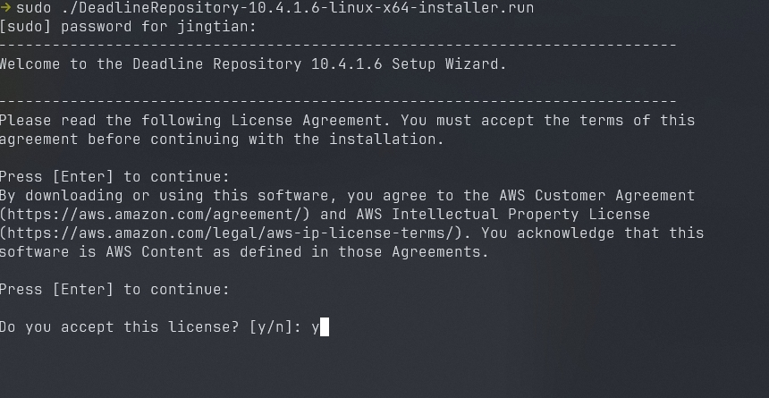

Next step is to setup the repository, we will use a custom one so we can track it easiy:

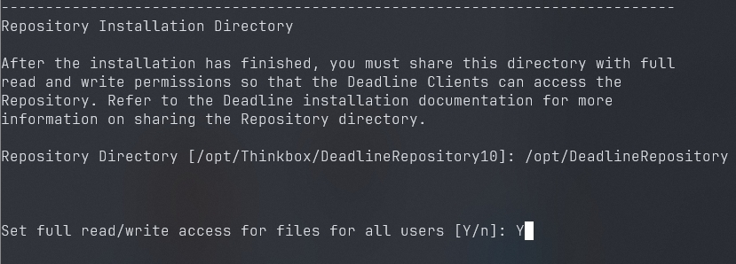

Next step asks about the database type, we pick MongoDB: MongoDB

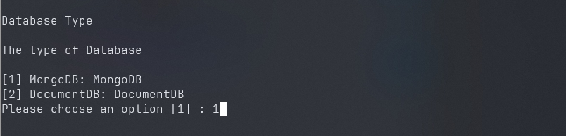

It will then ask if we want to install one, or use existing one, since we setup our MongoDB already, we will use option 2:

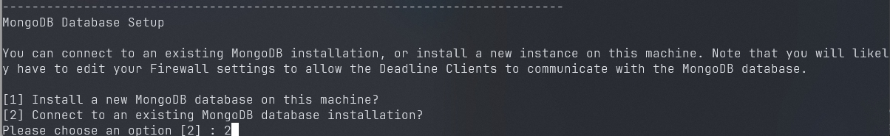

It will then ask for IP, Ports and the Database Name for the new mongoDB data base, we will provide the LAN IP of the server machine, To check the MongoDB port, go to this file:
```
vim /etc/mongod.conf
```
and check the ip settings under
```
# network interface
net:
    port: 27017
```
For the Replica Set, we will leave it empty, the following image shows all the setting for the MongoDB Database Settings section:

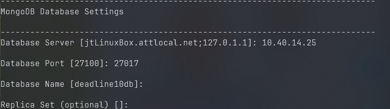

The data base is set up to allow any inquires without authetication, we can just say ```N``` fort the User SSL/TSL when communcating with server, there is also some mention of Legacy Deadline Monitor UI, we do not care about it, just press Enter to continue that question, and finally, Say ```N``` to the import settins from a previous Repository export.

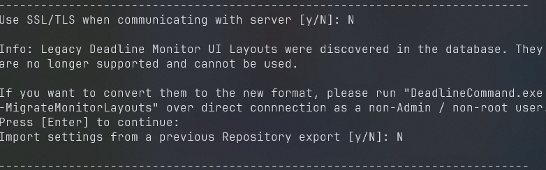

That should be all the MongoDB settings we need, the installer will say setup is ready to install, type in ```Y``` and hit enter.

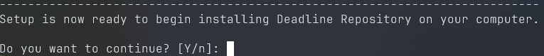

The install will just take a few seconds, once all done, It will say the Setup has finished:

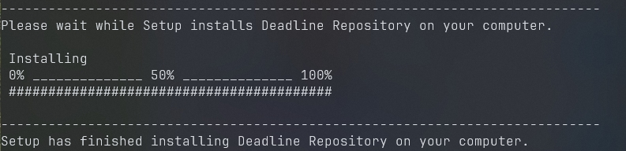

## Step 3 Install Remote Connection Server

Fire up the installer of the DeadlineClient(it is also used to install the Remote Connection Server(I know, it is super confusing)):

```sh
sudo ./DeadlineClient-<version>-linux-x64-installer.run
```
Same as the Respository installer, it askes for confirmation and accepting the agreement:

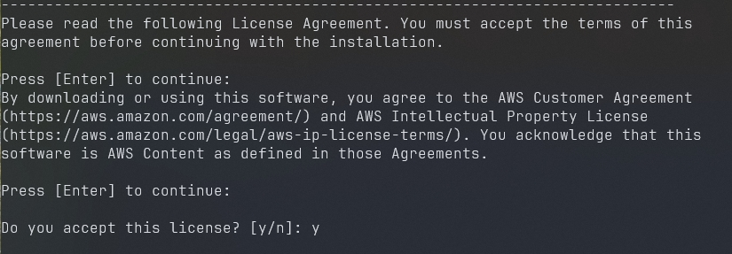

Next, it will ask for the install location, make one of our own for better organization:

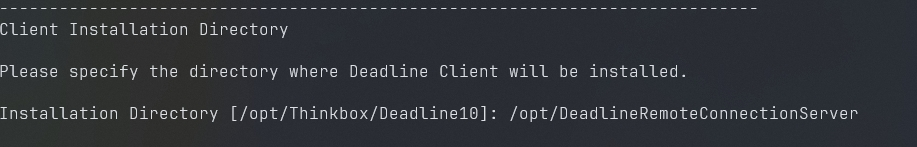

For the Install type, be sure to pick Remote Connection Server:

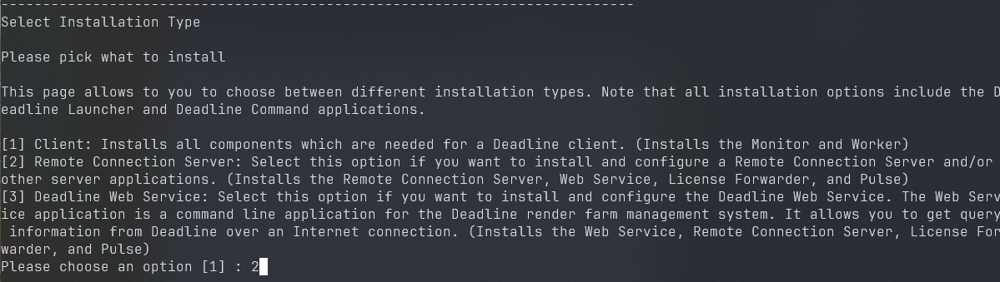

We will use our local path we setup when installing the Deadline Repository as the Deadline Repository path:

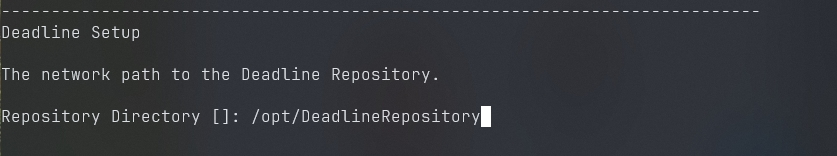

For the Deadline Launcher, the remote control setting is Block it:

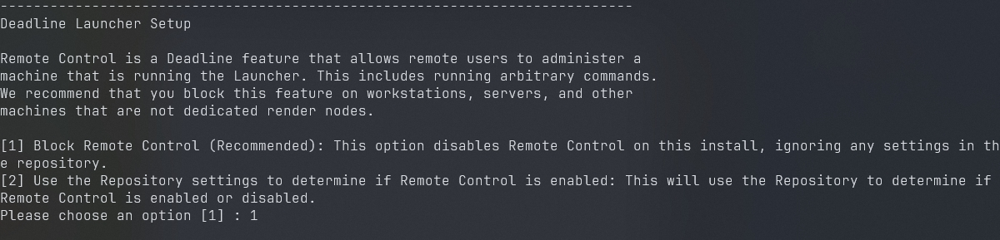


Not sure if we should install it as a Deamon, so used the default setting: ```N``` But if we want the Remote Connection Server to be running as a service, we should say ```Y```

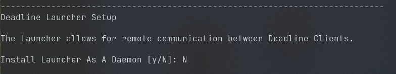

We also use default setting for auto update:

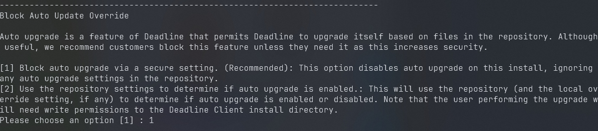


For the User of the Remote Connection Server, user your current user name:

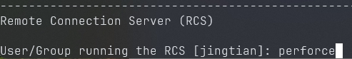


We do want to require external Clients to use TLS (Recommened), and for the ports, we just use the default settings

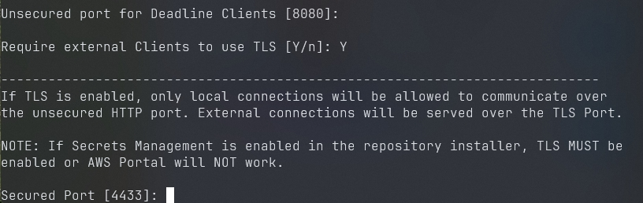

The Launcher starts RCS whenever RCS isn't running is set to ```Y```

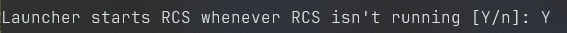


We will whant the tool to generate the TLS certificates for the client to use to connect to it:
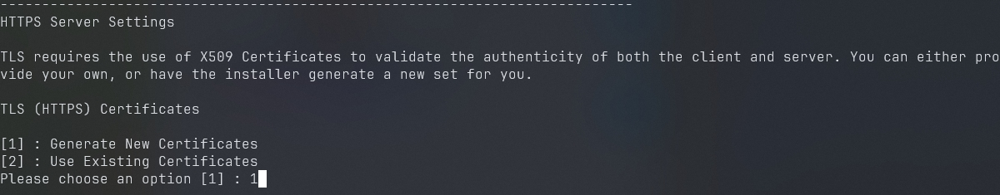


We then need to provide the location of the certificates, make our own for better management, and  don't forget to give a password for better security:

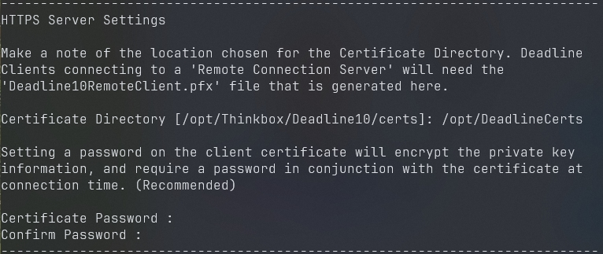


Finally, confirm and install the Remote Connection Server

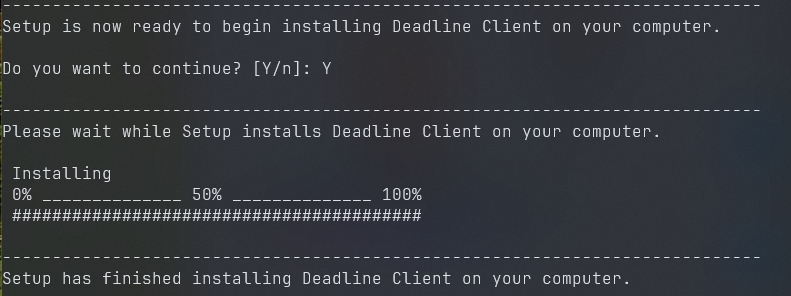

That should conclude the installation process of the Remote Connection Server.

To launch ther Deadline Remote Connection Server, run:

```
/opt/DeadlineRemoteConnectionServer/bin/deadlinercs
```

The Generate Certificate should be inside the provided location above, be sure to change the ownership of the file so it can be shared to the clients.

```
TODO: We probably need to set the remote connection server as a service.
```
