# Deadline Documentation

Userful Topics:

[Administration](./Documents/Admin.md)

## Qickstart

### Install Deadline Client
First, Add the shared network location to the local machine:

Fire up a powershell, type in:
```
net use S: \\10.40.14.25\RenderSourceRepository /user:perforce uiw3d /persistent:yes
```
This will create an S drive on the computer that can be used as unified network location for all the render workers to find maya project, textures, and other assets.

```You only have to do this once per machine```


Go to the new ```S``` drive, and copy these 2 files to any folder on your machine:

```
S:/DeadlineClientInstallers/Deadline-10.4.1.6-windows-installer/DeadlineClient-10.4.1.6-windows-installer.exe
```

```
S:/DeadlineClientInstallers/Deadline10RemoteClient.pfx
```

open ```DeadlineClient-10.4.1.6-windows-installer.exe``` to install the client.

Click next on the welcome page:

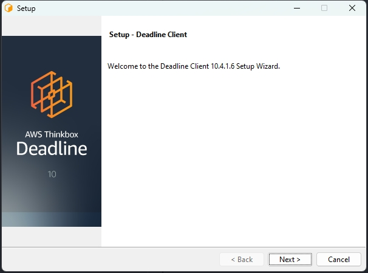

Accept the Agreement:

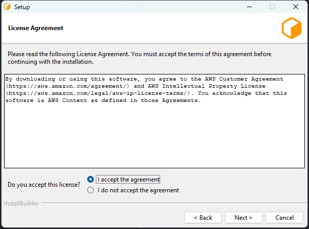

Using the Default Install location if you do not care to put it anywhere else:

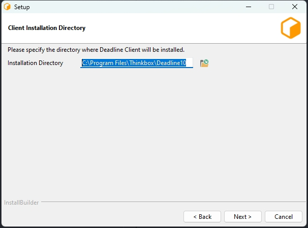

Set the Install Type to Client:

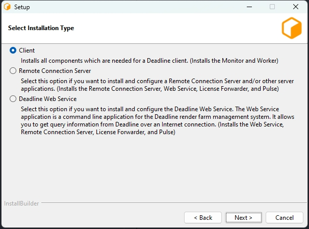

Set the Remote Cnnection Type to ```Remote Connection Server(Recommended)```

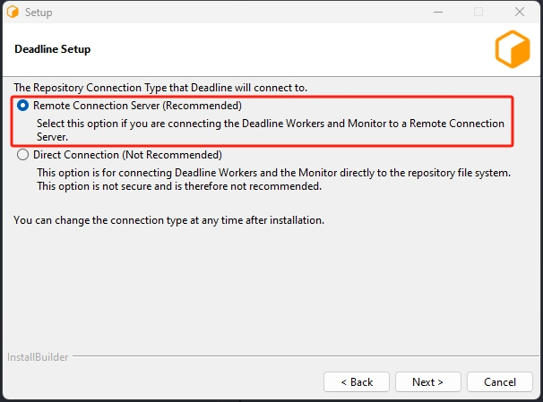

Both the Perforce Server and the Deadline Server is on the same server:
| Ip |Port   |
|---|---|
|10.40.14.25|4433|

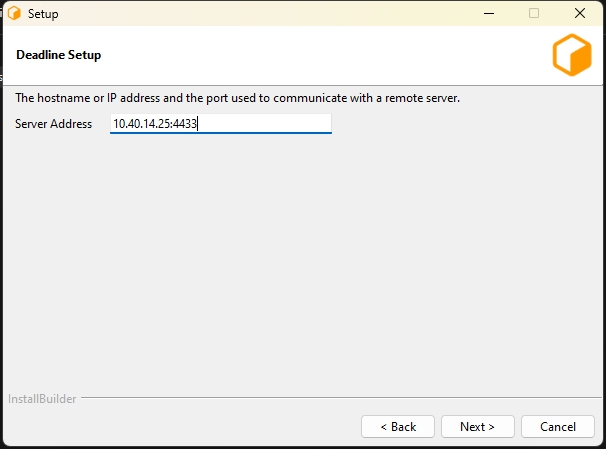

For the RCS TLS Certificate, use the one you copied from the ```S``` Drive. And the Certificate Password is ```uiw3d```

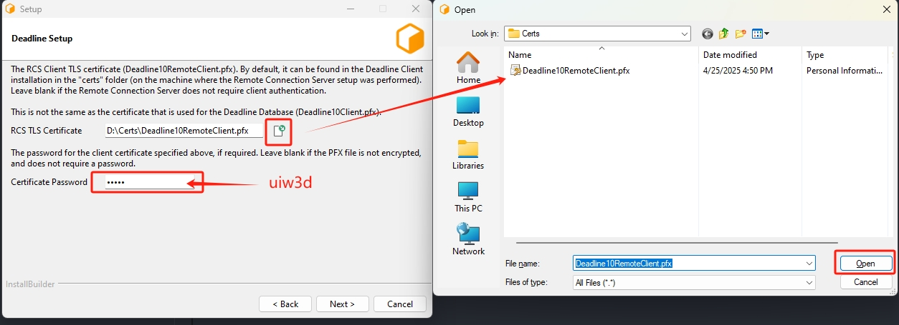

For the Deadline Launcher Setup, set it to ```Block Remote Control``` 

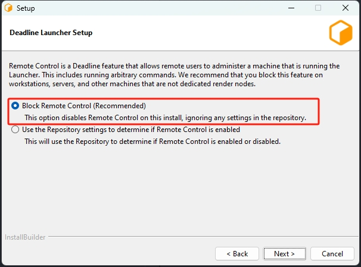

Also ```Block Auto Upgrade```

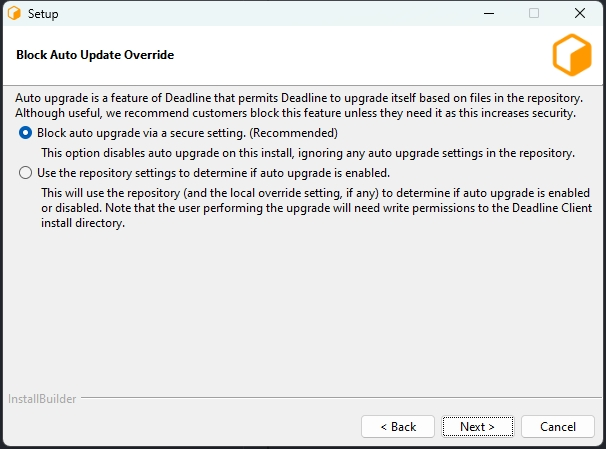

Click ```Next``` in the Ready to Install step:

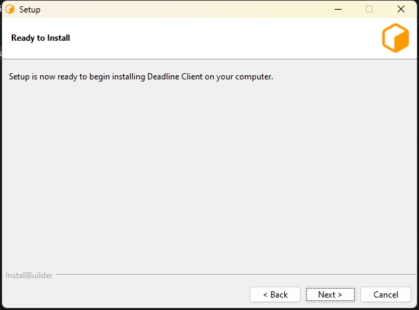

The installer should start install the client, should take a few minutes to finish.

Once the installer is finished, you can launch the ```Deadline Monitor``` and it should automatically connect to the deadline server:

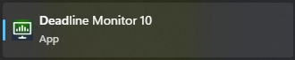

If the conenct was not successful, you can hit ok to the error message, and it should allow you to reconfigure again, the image shows the correct settings (the Passphrase is uiw3d), and the Advanced TLS Options should be the first one.

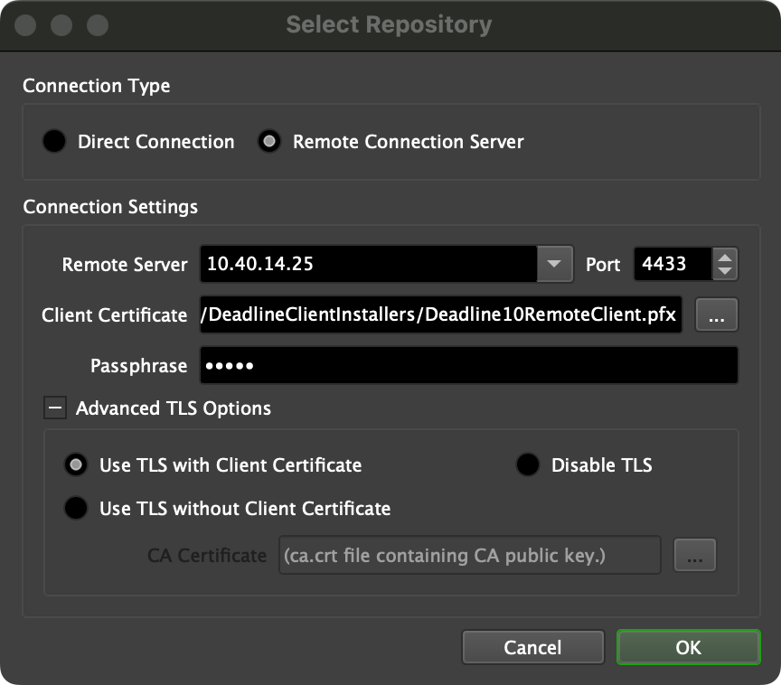